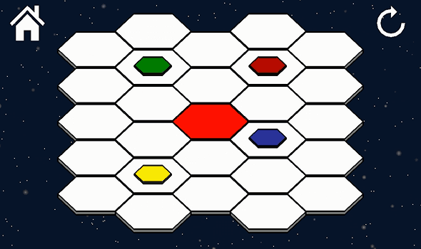

# Lunar Hex Android

An android port of my [Lunar Hex game](http://shake-n-baker.github.io/game-lunar-hex.html) originally written in Adobe Flash. The objective of the game is to get the red piece to the middle by sliding the pieces into each other. The rules are as follows:

1. A piece may slide in the direction of any of the 6 adjacent hexagons
2. The piece may only slide if it will eventually come to a stop by sliding into another piece
3. The player wins when the red piece stops sliding on the center hexagon, marked in another shade of red

The concept is based on the board game Lunar Lockout but with the twist of using hexagons instead of squares.

Find it on [Google Play](https://play.google.com/store/apps/details?id=com.isb.lunarhex&hl=en "Google Play link") or watch the [Trailer](https://www.youtube.com/watch?v=mGA40GAv9J8 "YouTube link") on YouTube.

## Author

Ian Baker ([@IanDevsGames](https://twitter.com/IanDevsGames "Follow me on twitter @IanDevsGames"))

Email: <ianbaker24@gmail.com>